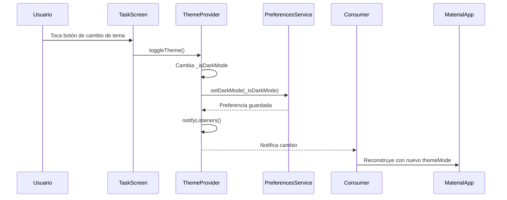

## Cambios recientes y explicación

### Sistema de temas dinámico (30 de Junio, 2025)
- **Archivos nuevos:**  
  - `lib/provider_task/theme_provider.dart`  
  - `lib/services/preferences_service.dart`  
- **Archivos modificados:**  
  - `lib/main.dart`  
  - `lib/screens/tarea_screen.dart`  
- **¿Qué se hizo?**  
  Se implementó un sistema de cambio de tema entre claro y oscuro. Se creó un `ThemeProvider` para gestionar el estado del tema y un `PreferencesService` para persistir la preferencia del usuario usando Hive. Se agregó un botón en el AppBar para alternar entre temas.  
- **¿Para qué?**  
  Para permitir al usuario personalizar la apariencia de la app según sus preferencias y mejorar la experiencia de uso en diferentes condiciones de iluminación.

---

### Workflow del cambio de tema

**Última actualización: 30 de Junio, 2025**