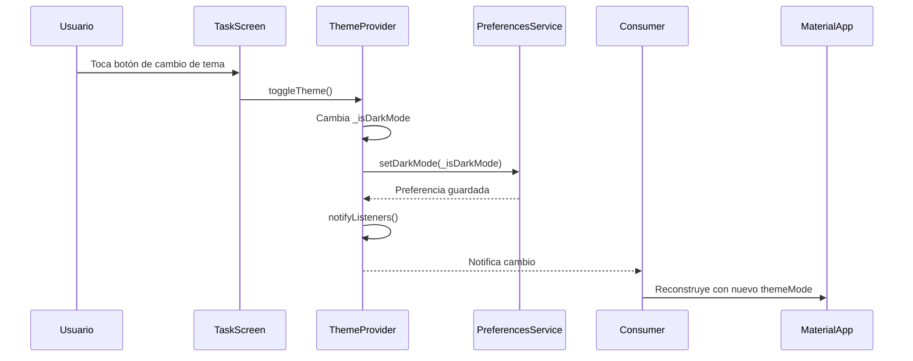

```mermaid
---
id: a5ddffda-8199-44a1-bcc6-a4d2988a31b1
---
sequenceDiagram
    participant Usuario
    participant TaskScreen
    participant ThemeProvider
    participant PreferencesService
    participant Consumer
    participant MaterialApp

    Usuario->>TaskScreen: Toca botón de cambio de tema
    TaskScreen->>ThemeProvider: toggleTheme()
    ThemeProvider->>ThemeProvider: Cambia _isDarkMode
    ThemeProvider->>PreferencesService: setDarkMode(_isDarkMode)
    PreferencesService-->>ThemeProvider: Preferencia guardada
    ThemeProvider->>ThemeProvider: notifyListeners()
    ThemeProvider-->>Consumer: Notifica cambio
    Consumer->>MaterialApp: Reconstruye con nuevo themeMode
```